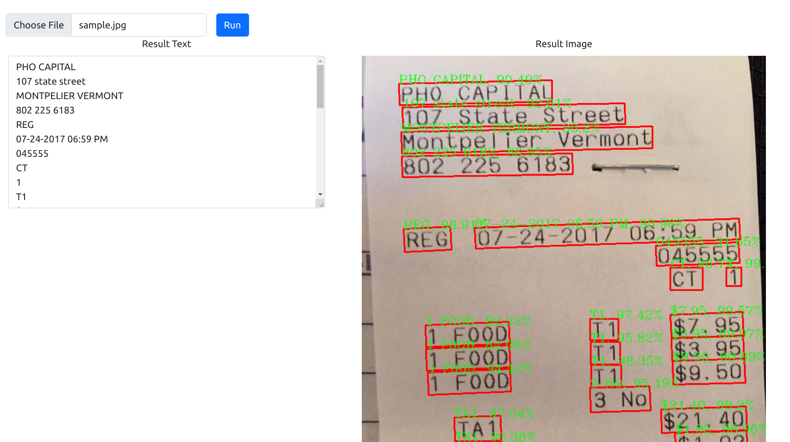

# PaddleOCR Deployment
## Description
This project includes a web-based deployment for PaddleOCR in Windows10.

The application powered by ONNXRuntime instead of PaddlePaddle because ONNXRuntime is easier to compile by pyinstaller.

## Installation
```bash
# prepare conda env
conda create -n paddleocr-onnx python=3.7
conda activate paddleocr-onnx

# install requirements
pip install -r requirements.txt

# (optional) if you want to run with CUDA
pip uninstall onnxruntime
pip install onnxruntime-gpu==1.9.0
```

I converted ch_PP-OCRv2_xx models to ONNX format in this project. (in `modles/`)  
You could follow the steps from PaddleOCR repo to convert your own models.

[https://github.com/PaddlePaddle/PaddleOCR/tree/release/2.4/deploy/paddle2onnx](https://github.com/PaddlePaddle/PaddleOCR/tree/release/2.4/deploy/paddle2onnx)

## Usage
### Run `app.py`
- Directly run `app.py`
    ```bash
    conda activate paddleocr-onnx
    python app.py
    ```
- Compile `app.py` by pyinstaller  
    You should get `onnxruntime_providers_shared.dll`, `onnxruntime_providers_cuda.dll` from your environment site-packages path.  
    (`C:/Users/[USER_NAME]/Anaconda3/envs/paddleocr-onnx/Lib/site-packages/onnxruntime/capi`)

    ```bash
    conda activate paddleocr-onnx
    pyinstaller -F --add-data "onnxruntime_providers_shared.dll;onnxruntime/capi" --add-data "static/main.js;static" --add-data "templates/index.html;templates" app.py
 
    # (optional) if you want to run with CUDA
    pyinstaller -F --add-data "onnxruntime_providers_shared.dll;onnxruntime/capi" ----add-data "onnxruntime_providers_cuda.dll;onnxruntime/capi" --add-data "static/main.js;static" --add-data "templates/index.html;templates" app.py
    ```

    Place `app.exe` with `models/` and execute it.

## Demo

